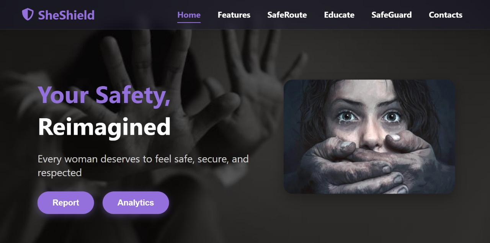
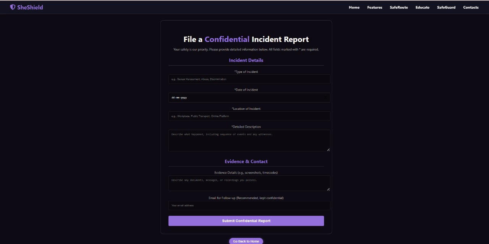
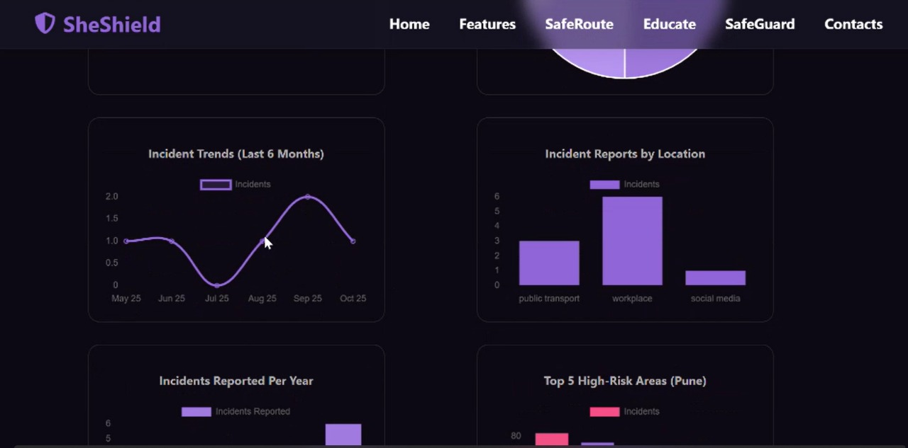
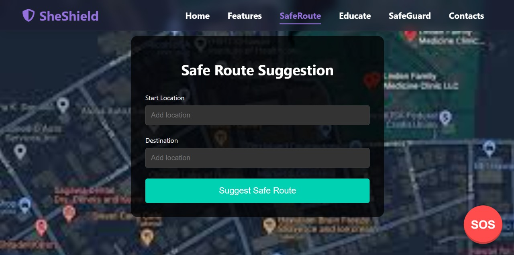
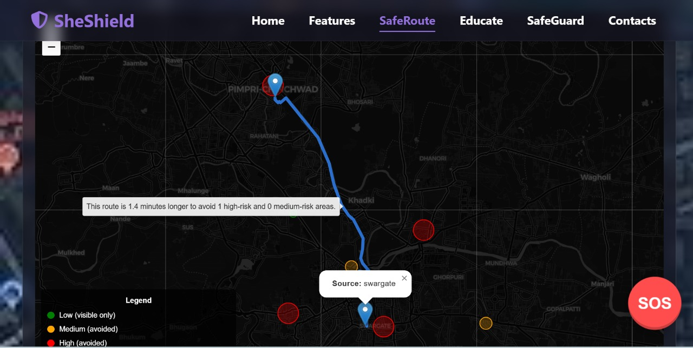
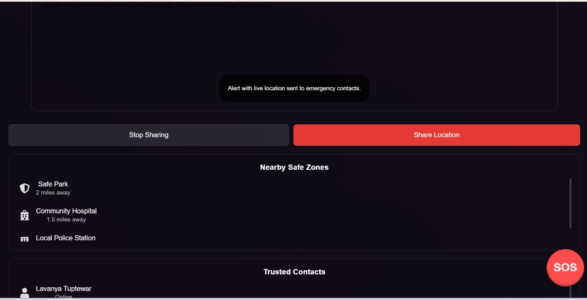
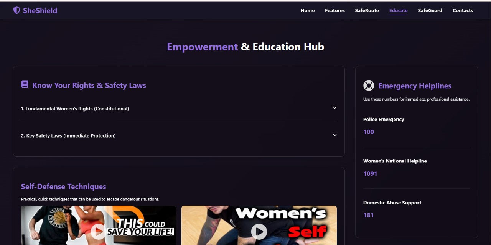

# 🛡️ HerShield – Real-Time Women’s Safety & Safe Routing Platform

SheShield is a next-generation women’s safety web platform that combines real-time reporting, analytics, safe navigation, and education — **powered by genuine Pune police crime data (Jan–Oct 2024)**. Designed for both urgent response and day-to-day prevention, this project brings together full-stack engineering, live mapping, and social responsibility.

---

## 💡 Why I Built This

Every day, women in India and around the world face harassment and threats — on campuses, streets, and even at work or online. Most solutions only respond after something bad has happened.  
**SheShield is different:**  
It’s built to *prevent* danger, give real-time situational awareness, and empower users to proactively avoid unsafe areas. My vision was to create technology that not only reacts, but protects, educates, and helps women take control — using real police data, not just assumptions.

---

## 🚀 Key Features

- **Real-Time Complaint Reporting**  
 Instantly log and submit harassment or safety complaints. All reports are reflected live in the analytics dashboard for open community awareness and authorities.

- **Intelligent Safe Route Mapping**  
  Enter start and destination to get the *safest* (not just fastest) route, actively avoiding high-risk areas.  
  - Risk zones are mapped using 2024 Pune police data.
  - Street view of each zone lets users visually check the route before traveling.

- **Emergency SOS with Smart Rescue**  
  One-tap SOS instantly:
    - Sends live location alerts (via Twilio SMS) to emergency contacts
    - Displays nearest *safe zones* (cafes, police stations, hospitals)
    - Reroutes user to the closest police station in real time

- **Empowerment & Education Hub**  
  In-app portal with:
    - Easy guides to key safety and rights laws
    - Videos for self-defense and practical safety
    - Always-updated emergency numbers

---

## 📸 Screenshots

<p>
  
  
  
  
  
  
  
  
</p>

---

## 🧰 Tech Stack Highlights

- **Frontend:** React.js, HTML5, CSS3
- **Backend:** Node.js, Express.js
- **APIs:** OpenRouteService for routing, Leaflet.js for maps, Twilio SMS for emergency alerts
- **Database:** MongoDB Atlas
- **Data Science:** Live analytics and risk mapping built from real Pune women’s crime dataset (2024)

---

## 📊 Real Data, Real Impact

- Every route and risk zone is calculated from *actual* crime data, not hypothetical estimations.
- Analytics and reporting empower the community — not just individuals — to prevent crime.

---

## 🏆 What Sets SheShield Apart

- Vision: Moves "women safety" from reaction to *prevention* and empowerment.
- Effectiveness: Combines real-time incident reporting, live analytics, and actionable routing.
- Engineering: Full-stack, modern, scalable codebase with strong API and data integration.
- Social Responsibility: Built to solve a real, daily pain point for millions.

---

## 🛠️ Getting Started


Follow these steps to run **SheShield** locally. The project includes both frontend (React) and backend (API, alerts).

## Prerequisites

- Node.js (v16+)
- npm (comes with Node.js)
- MongoDB Atlas account (for production, or run MongoDB locally for dev)
- OpenRouteService API key (for routing, [sign up here](https://openrouteservice.org/))
- Twilio account for SMS alerts ([sign up here](https://www.twilio.com/))
- Python and Flask if your route-safety backend uses Python

---

## Frontend Setup

```bash
# Clone the repository
git clone https://github.com/LavanyaT809/she-shield-women-safety-app.git
cd she-shield-women-safety-app/women_safety_map2

# Install frontend dependencies
npm install --legacy-peer-deps

# Run the React development server
npm run dev

cd ../backend

# Install backend dependencies
npm install

# Set up environment variables (create a .env file based on sample.env or docs)
# Example .env content:
# MONGO_URI=your-mongo-connection-string
# ROUTESERVICE_API_KEY=your-openrouteservice-key
# TWILIO_SID=your-twilio-sid
# TWILIO_AUTH_TOKEN=your-twilio-token
# TWILIO_PHONE=your-twilio-phone

# Run the backend server
npm run start
```

## 📜 License

SheShield is licensed under the MIT License – see the [LICENSE](LICENSE) file for details.


---

**SheShield isn't just an app — it's a stand against everyday harassment. Feel free to use, extend, or collaborate!
Connect on [LinkedIn](https://www.linkedin.com/in/lavanya-tuptewar) for more.**

